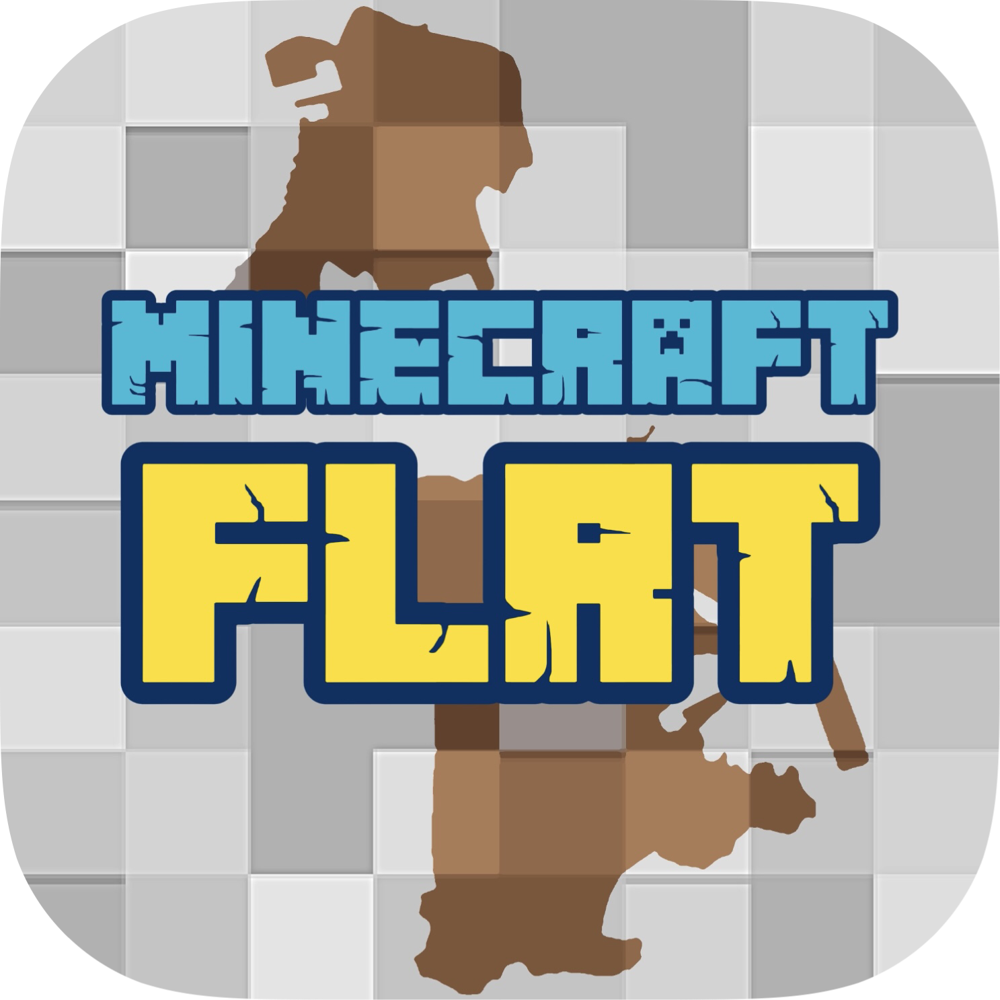

# FLRT-ResourcePack
 

FLRT-ResourcePack is a resource pack for FLRT Minecraft server using.
The resourcepack project at here was created by JS_arthurliao at March 6th, 2024.
___
## Current branch: 
|master|
|:--:|

## Main information
**About:**
FLRT-ResourcePack **master** branch.
A branch which will be always update frequently!

**Owner&Co-owner:** [@HiltonLai](https://github.com/HiltonLai) & [@JS_arthurliao](https://github.com/JSarthurliao)

> [!WARNING]
> You shall not shared any files or send these resourcepack files to public without authorized by owner of "FLRT ResourcePack" [@HiltonLai](https://github.com/HiltonLai)

## How to use?!
### Guide wizard:
1. Join FLRT Discord server from [**HERE**](https://discord.com/invite/vZGpr4WTBy)
2. Warp to [**THIS CHANNEL**](https://discord.com/channels/1059729297365008404/1125442238734930071) in Discord FLRT server!
3. Follow the current description in the following channel to link to download link
4. After all, launch your Minecraft[^1]
5. Enable your resource pack first before you join the server[^2]
6. Congratulations! You complete all the following steps!

[^1]:  Please follow from [HERE](https://discord.com/channels/1059729297365008404/1125442391034306652) to setup your Minecraft for joinging FLRT Minecraft server

## Working progress

<table>
    <tr>
        <th>catagory</th>
        <th>check_mark</th>
        <th>statements</th>
        <th>code list</th>
    </tr>
    <tr>
        <td rowspan="3">mtr</td>
        <td><ul><li>[ ] </li></ul></td>
        <td> Develop</td>
        <td>"o2" ocean_cruiser model</td>
    </tr>
    <tr>
        <td><ul><li>[x] </li></ul></td>
        <td> Update</td>
        <td>mtr custom font</td>
    </tr>
    <tr>
        <td><ul><li>[x] </li></ul></td>
        <td> Update</td>
        <td>mtr custom sign</td>
    </tr>
    <tr>
        <td>jsblock</td>
        <td><ul><li>[ ] </li></ul></td>
        <td> Develop</td>
        <td>

              
custom pids

              Full name: passanger information dynamic system
            
</td>
    </tr>
    <tr>
        <td>mlm</td>
        <td><ul><li>[x] </li></ul></td>
        <td> Update</td>
        <td>custom mlm repository sounds</td>
    </tr>
    <tr>
        <td>eyemod</td>
        <td><ul><li>[x] </li></ul></td>
        <td> Update</td>
        <td rowspan="2">language files update and fixed</td>
    </tr>
    <tr>
        <td>car</td>
        <td><ul><li>[x] </li></ul></td>
        <td> Update</td>
    </tr>
</table>

### Knowned issues and fixed

  
Minecraft

  <ul><li>
     - [ ] #1
  </li></ul>

  
MTR

  <ul><li>
      - [ ] 
  </li></ul>

### Plan and new add announcement
##### Notes
